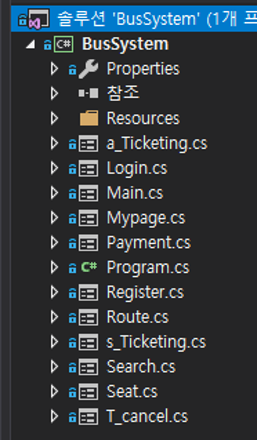
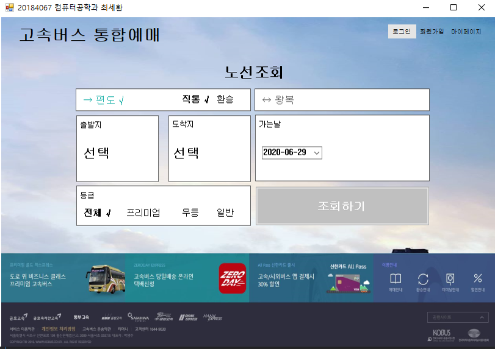
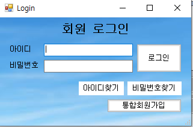
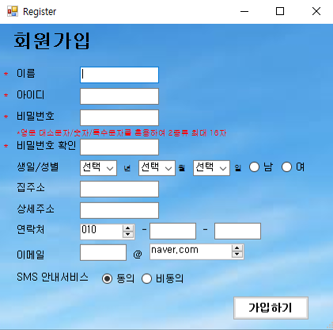
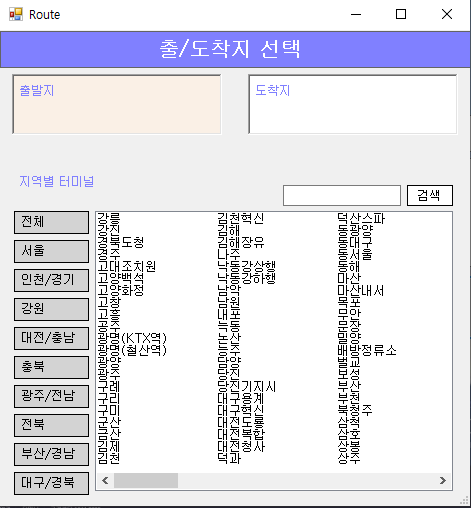
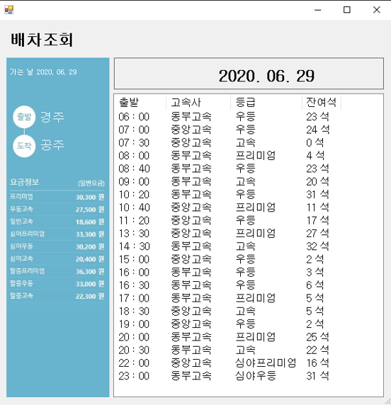
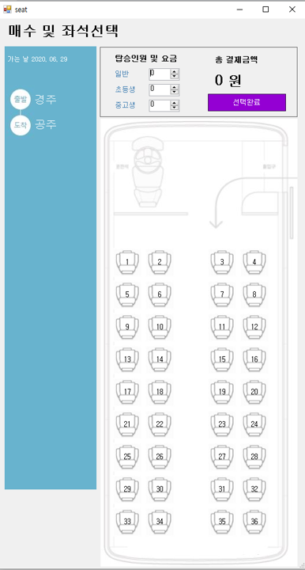
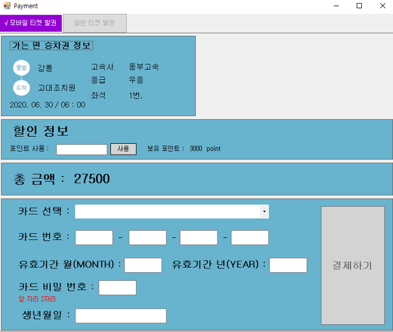
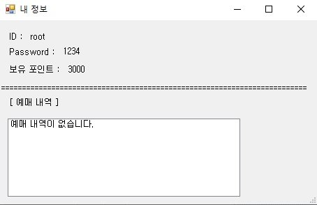
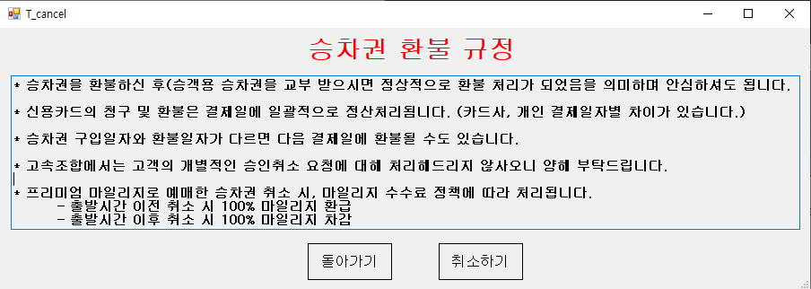

# 버스 예약 시스템
##### 3학년 1학기 Windows Programing
### [ C# 텀프로젝트 ]

---

* 개발언어 : C#
* 개발환경 : Visual Studio

---

[ 구현 사항 ]
1. 로그인/회원가입
2. 마이페이지
3. 편도/왕복
4. 좌석 선택 (중복 방지)
5. 포인트 사용/차감
6. 예약/예약조회/예약취소

---

** [ 파일 구조 ] **   

---
** 1. Main.cs  **     

---
** 2. Login.cs **   

---
** 3. Register.cs **    

---
** 4. Route.cs **     

---
** 5. s_Ticketing.cs / a_Ticketing.cs **     

---
** 6. Seat.cs **  

---
** 7. Payment.cs **   

---
** 8. MyPage.cs **    

---
** 9. t_Cancel.cs **     

---
